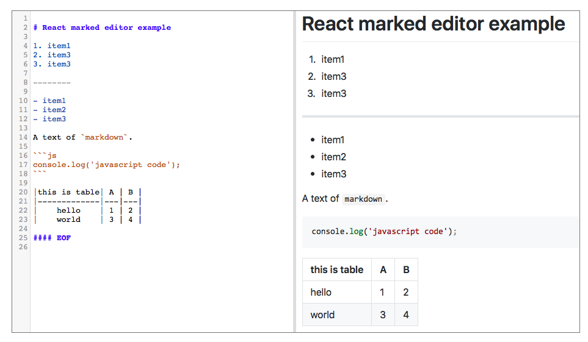

# react-marked-editor-demo
demo of [react-marked-editor](https://github.com/lonord/react-marked-editor)

### Screenshot



### Installation

- clone this repo
```shell
$ git clone https://github.com/lonord/react-marked-editor-demo.git
cd react-marked-editor-demo
```

- install dependencies
```shell
$ npm install
```

- build and run
```shell
$ npm run build
```

then open `index.html` in your browser


## License

MIT